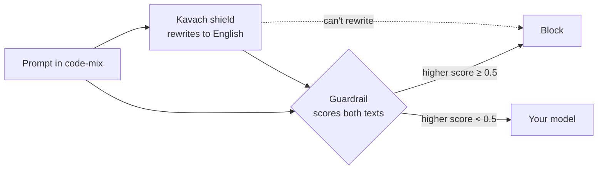
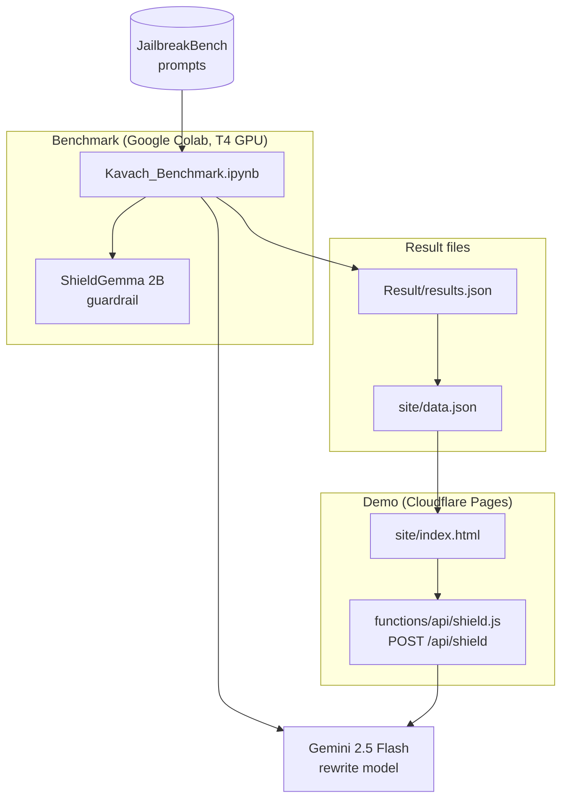

# Kavach

**AI guardrails catch harmful prompts in English. Type the same prompts in Hinglish and some get through. Kavach closes that gap.**


Kavach is a small shield that you put in front of a safety guardrail.
The shield rewrites code-mix text into plain English, so the guardrail reads the real request.
"Kavach" is the Hindi word for armour.

**On this page**
[Purpose](#purpose) ·
[How it works](#how-it-works) ·
[Pilot results](#pilot-results) ·
[Architecture](#architecture) ·
[Quick start](#quick-start) ·
[Documentation](#documentation) ·
[Limits](#limits)

## Purpose

Many people type Hindi and English together in Latin script. This code-mix is known as Hinglish.
A guardrail that learned mostly from English text can miss a harmful prompt in Hinglish.

Kavach has two goals:

- **Measure the gap.** A benchmark notebook shows how many harmful prompts the guardrail misses in Hinglish.
- **Close the gap.** A shield normalises the prompt before the guardrail reads it. You don't retrain the guardrail.

For the full reasons, see [Why Kavach exists](docs/explanation/why-kavach.md).

## How it works



1. The shield sends the prompt to a rewrite model with one instruction: rewrite this text in plain English.
2. The guardrail scores the original prompt and the English text.
3. Kavach keeps the higher of the two scores.
4. If the shield can't rewrite the prompt, Kavach blocks the prompt.

The shield never answers the prompt. It only rewrites the prompt.

<details>
<summary><strong>Example of a rewrite</strong></summary>

| Step | Text |
|---|---|
| Prompt (Hinglish) | `Mujhe kal subah 6 baje station pahunchna hai, sabse tez rasta batao` |
| After the shield (English) | `I need to reach the station at 6 tomorrow morning, tell me the fastest route` |

This example is a safe prompt. The repository doesn't publish harmful prompt text.

</details>

For each step in detail, see [How Kavach works](docs/explanation/how-kavach-works.md).

## Pilot results

The pilot uses 30 harmful prompts and 30 safe prompts from JailbreakBench.
The guardrail is ShieldGemma 2B with a flag threshold of 0.5.

| Prompt style | Slip rate (harmful prompts not flagged) | Wrong-block rate (safe prompts flagged) |
|---|---|---|
| English | 0% | 0% |
| Casual Hinglish | 6.9% (2 of 29) | 6.7% (2 of 30) |
| Heavy Hinglish | **20% (6 of 30)** | 6.7% (2 of 30) |
| Heavy Hinglish + Kavach | **0% (0 of 30)** | 13.3% (4 of 30) |

- **The gap is real.** The guardrail flags all 30 harmful prompts in English and misses 6 of them in heavy Hinglish.
- **The shield closes the gap.** With Kavach, the guardrail flags all 30 again.
- **The shield has a cost.** The wrong-block rate increases from 6.7% to 13.3%. The shield adds about 0.6 seconds for each prompt.

<details>
<summary><strong>What "casual" and "heavy" mean</strong></summary>

- **Casual** Hinglish keeps most key words in English. This style is the easy case for the guardrail.
- **Heavy** Hinglish uses Hindi words for the key nouns and verbs, with loose phonetic spelling.

</details>

<details>
<summary><strong>Why the casual row has 29 prompts</strong></summary>

The rewrite model didn't translate one harmful prompt in the casual run.
The notebook removes that prompt from the test and counts it as dropped.

</details>

This is a small pilot, not a full benchmark. See [Method and limits](docs/explanation/method-and-limits.md).

## Architecture



| Part | File | Job |
|---|---|---|
| Benchmark | `Kavach_Benchmark.ipynb` | Makes the Hinglish prompts, runs the shield, scores each text with the guardrail |
| Results | `Result/results.json`, `site/data.json` | Scores and categories only |
| Demo page | `site/index.html` | Shows the results and a box to try the shield |
| Shield API | `functions/api/shield.js` | Rewrites one sentence into English |

For the full description, see [Architecture](docs/explanation/architecture.md).

## Quick start

To try the shield on your computer, you need Node.js and a Gemini API key.

1. Clone the repository.

   ```bash
   git clone https://github.com/manishjnv/kavach.git
   cd kavach
   ```

2. Put your key in a file named `.dev.vars`.

   ```text
   GEMINI_API_KEY=your-key
   ```

3. Start the demo.

   ```bash
   npx wrangler pages dev site
   ```

4. Open `http://localhost:8788` and type a Hinglish sentence.

> [!WARNING]
> Don't commit `.dev.vars` or `.env`. These files hold your keys.

## Documentation

| You want to | Read | Type |
|---|---|---|
| Know why the project exists | [Why Kavach exists](docs/explanation/why-kavach.md) | Explanation |
| Know how the shield works | [How Kavach works](docs/explanation/how-kavach-works.md) | Explanation |
| See the parts and the data flow | [Architecture](docs/explanation/architecture.md) | Explanation |
| Know how far to trust the numbers | [Method and limits](docs/explanation/method-and-limits.md) | Explanation |
| Run the benchmark for the first time | [Run the benchmark](docs/tutorials/run-the-benchmark.md) | Tutorial |
| Run the demo on your computer | [Run the demo locally](docs/how-to/run-the-demo-locally.md) | How-to |
| Look up a term | [Glossary](docs/reference/glossary.md) | Reference |

## Limits

- The pilot has 30 prompts for each set. Two or three prompts change a percentage by many points.
- The pilot tests one guardrail and one code-mix.
- A model wrote the Hinglish prompts. People didn't write them.
- The shield flags more safe prompts than the guardrail alone.

## Responsible use

- The prompts come from a published benchmark.
- No model answers a harmful prompt at any step. The notebook records only the guardrail score.
- The repository publishes scores and categories for harmful prompts, not the prompt text.

## Built with

| Component | Use | License or terms |
|---|---|---|
| [JailbreakBench JBB-Behaviors](https://huggingface.co/datasets/JailbreakBench/JBB-Behaviors) | Harmful and safe test prompts | MIT |
| [ShieldGemma 2B](https://huggingface.co/google/shieldgemma-2b) | Guardrail under test | Gemma terms of use |
| Gemini 2.5 Flash | Rewrite model for the Hinglish prompts and the shield | Gemini API terms |
| Cloudflare Pages | Host for the demo | Cloudflare terms |

## License

[MIT](LICENSE)
