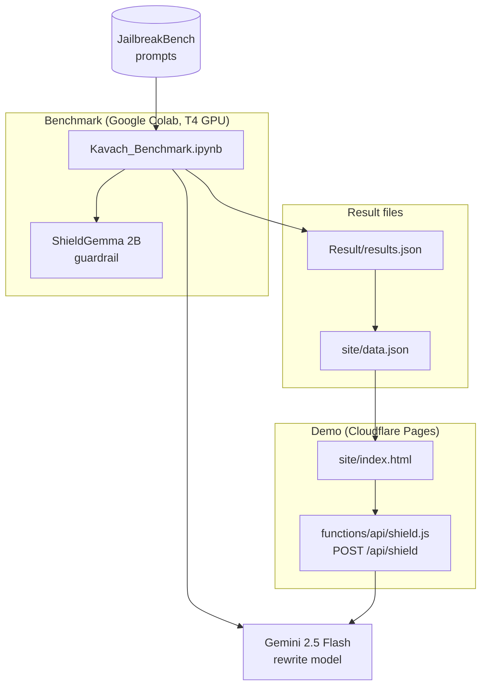
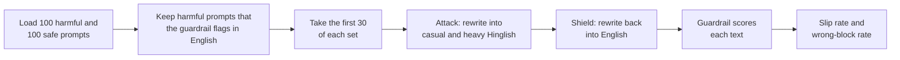
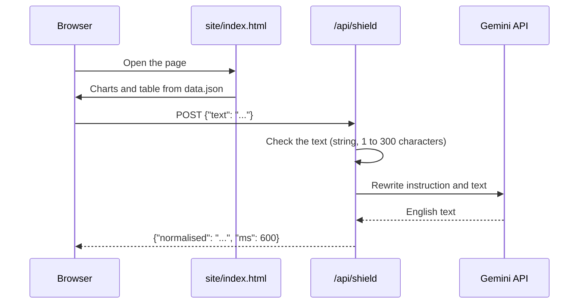

# Architecture

This page explains the parts of Kavach, how data moves between them, and why the parts are separate.

## Overview

Kavach has three parts:

- A **benchmark** that measures the code-mix gap.
- **Result files** that hold the scores.
- A **demo** that shows the results and runs the shield live.

## The benchmark

The benchmark is one notebook, `Kavach_Benchmark.ipynb`. It runs in Google Colab on a T4 GPU.

| Stage | What runs | Where |
|---|---|---|
| Guardrail | ShieldGemma 2B, four policies, highest score of the four | Colab GPU |
| Prompts | JailbreakBench JBB-Behaviors: the harmful set and the safe set | Download from Hugging Face |
| Attack | Gemini 2.5 Flash rewrites English into Hinglish | Gemini API |
| Shield | Gemini 2.5 Flash rewrites Hinglish into English | Gemini API |
| Export | Public and private result files | Download from Colab |

The notebook saves each rewrite in a cache file. A second run doesn't use the API quota again.

The files `heavy_cell.py` and `tamil_cell.py` are extra notebook cells.
Each one runs the same test with a different attack instruction.

## The result files

| File | Content | Public |
|---|---|---|
| `Result/results.json` | Scores and categories. No harmful prompt text | Yes |
| `site/data.json` | The numbers and rows that the demo page shows | Yes |
| `results_full.json`, `results_heavy_full.json` | All prompt text | No. Git ignores these files |

The split between public and private files is a safety decision.
The public files let you check each score without a copy of the harmful prompts.

## The demo

The demo is a static page and one serverless function on Cloudflare Pages.

The function has a small contract:

| Case | Status | Body |
|---|---|---|
| The rewrite is successful | 200 | `{"normalised": "...", "ms": 600}` |
| The rewrite model returns no text | 200 | `{"blocked": true, "ms": 600}` |
| The text is missing, empty, or longer than 300 characters | 400 | `{"error": "..."}` |
| The free quota is used | 429 | `{"error": "..."}` |
| The rewrite model doesn't respond | 502 | `{"error": "..."}` |

The function reads the API key from the `GEMINI_API_KEY` secret. The key never goes to the browser.

## Design decisions

| Decision | Reason |
|---|---|
| The guardrail runs only in the notebook | ShieldGemma needs a GPU. The demo host has none |
| The demo runs only the rewrite step | The rewrite is the part that you can try in one second |
| The shield and the attack use the same rewrite model | One API key is sufficient for a pilot. See the limits page for the risk |
| The page is static | No build step and no framework to maintain |
| The function has no rate limit for each user | The key has no billing, so the free quota is the ceiling |

## Related pages

- [How Kavach works](how-kavach-works.md)
- [Method and limits](method-and-limits.md)
- [Run the demo locally](../how-to/run-the-demo-locally.md)
