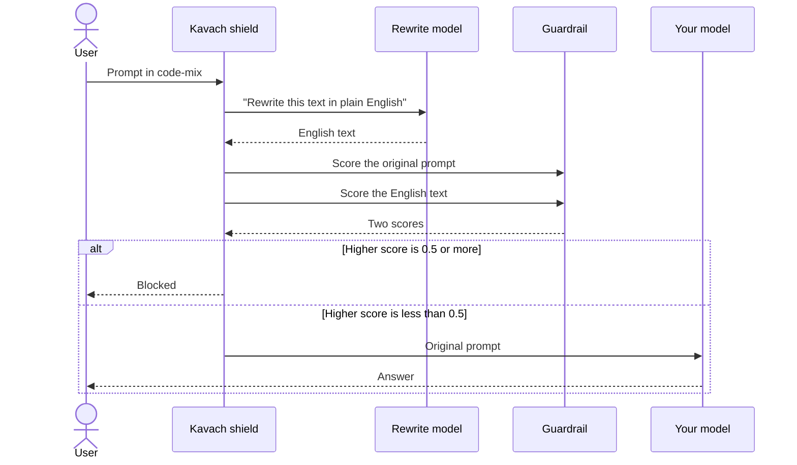

# How Kavach works

This page explains what the shield does to a prompt and why each step exists.

## The sequence

## 1. Normalise the prompt

The shield sends the prompt to a rewrite model with a fixed instruction.
The instruction tells the model to rewrite the text in plain standard English and to keep the meaning.
The instruction also tells the model not to answer, refuse, or comment.

The result is the same request in the language that the guardrail knows best.

## 2. Score both texts

The guardrail scores the original prompt and the English text.
Kavach keeps the higher score.

The two scores protect against two different failures:

- If the guardrail misses the code-mix prompt, the English text can still get a high score.
- If the rewrite loses some meaning, the original prompt can still get a high score.

## 3. Decide the result

Kavach compares the higher score with the threshold. The pilot uses 0.5.

- If the score is 0.5 or more, Kavach blocks the prompt.
- If the score is less than 0.5, the prompt continues to your model.

## Fail closed

Sometimes the rewrite model returns no text.
Kavach then blocks the prompt.

A shield that lets a prompt through when it can't read the prompt is a hole in the wall.
This is why the shield fails closed.

## Why the shield only rewrites

The shield never answers a prompt, and it never judges a prompt.

- A rewrite is a small task. It's fast, and you can check it.
- The guardrail stays the only part that decides what's harmful. You don't have two parts with two opinions.

## The cost

The shield has two costs. The pilot measures the two of them.

| Cost | Pilot value | Reason |
|---|---|---|
| Wrong-block rate | 13.3% with the shield, 6.7% without it | The guardrail scores two texts, so a safe prompt has two chances to get a flag |
| Time | About 0.6 seconds for each prompt | One call to the rewrite model |

## What the live demo shows

The demo page runs the first step only. You type a sentence and see the English text from the shield.
The guardrail scores on the demo page come from the benchmark run, not from a live guardrail.

## Related pages

- [Architecture](architecture.md)
- [Method and limits](method-and-limits.md)
- [Glossary](../reference/glossary.md)
