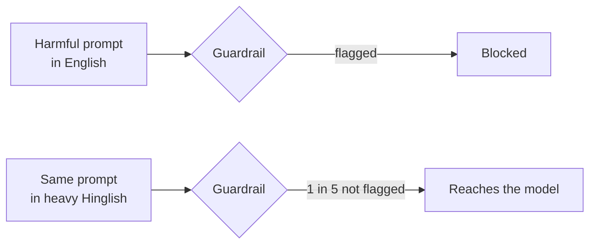

# Why Kavach exists

This page explains the problem that Kavach solves and the purpose of the project.

## The problem

A guardrail is a safety classifier. It reads a prompt and flags the prompt if the prompt breaks a policy.
Most guardrails learned from text in standard English.

Many people don't type in standard English. They type code-mix: two languages together, in Latin script, with loose phonetic spelling.
Hinglish, the mix of Hindi and English, is one example.

A harmful prompt keeps its meaning in Hinglish. The words and the spelling change.
A guardrail that flags the prompt in English can miss the same prompt in Hinglish.

In the pilot, the guardrail flags all 30 harmful prompts in English. It misses 6 of the same 30 prompts in heavy Hinglish.

## The purpose

Kavach has two purposes:

- **Measure the gap.** The benchmark notebook gives one number for the gap: the slip rate.
- **Close the gap.** The shield rewrites code-mix text into English before the guardrail reads it.

## Why a shield and not a new guardrail

| Option | Cost | Result |
|---|---|---|
| Retrain the guardrail on code-mix data | Training data for each language, compute, a new model to validate | A different model for each update |
| Put a shield in front of the guardrail | One rewrite call for each prompt | The same guardrail, with no change |

The shield is the smaller change:

- You keep the guardrail that you already validated.
- You add a language with a change to one instruction, not with a new training run.
- You can measure the effect with the same benchmark.

## Who Kavach is for

- Teams that operate a model for users who type in code-mix.
- Teams that test a guardrail and want a number for the code-mix gap.
- Researchers who compare guardrails across languages.

## What Kavach isn't

- Kavach isn't a guardrail. It doesn't decide what's harmful.
- Kavach isn't a full benchmark. The pilot is small.
- Kavach isn't a translation product. It rewrites text only to help the guardrail.

## Related pages

- [How Kavach works](how-kavach-works.md)
- [Method and limits](method-and-limits.md)
